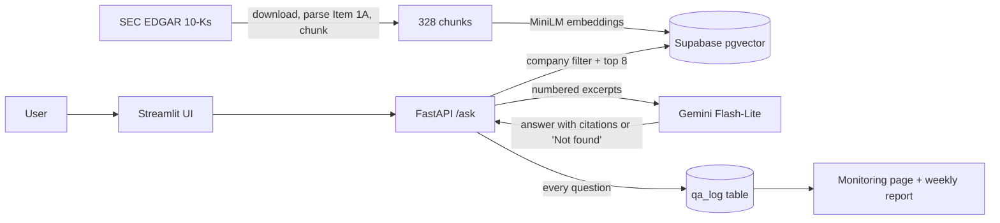

# Filings Q&A

Ask questions about the **Risk Factors** section of 10 companies' annual reports (10-K
filings) and get short answers that cite the filing, e.g. *"What does Tesla say about supply
chain risk?"*

A retrieval-augmented generation (RAG) system built as an MLOps project: a cloud data
pipeline, a verified 50-question test set, tracked experiments, a CI gate that blocks
changes when retrieval quality drops, a Docker app deployed automatically, and monitoring.
Runs entirely on free cloud services, with no credit card and no local LLM.

Companies: Apple, Microsoft, Tesla, JPMorgan Chase, Walmart, Pfizer, Exxon Mobil, Nike,
Netflix, Delta Air Lines (latest 10-K of each, from SEC EDGAR).

## How it works



1. **Pipeline** (`pipeline.yml`): download each company's latest 10-K, extract "Item 1A.
   Risk Factors" (10/10 sections), split into 400-word chunks with 50-word overlap, embed
   them with `all-MiniLM-L6-v2` and store them in Supabase pgvector.
2. **Retrieval**: if a question names a company ("Tesla", "TSLA", "JPMorgan"), only that
   company's chunks are searched; the top 8 by cosine similarity are kept.
3. **Answer**: Gemini sees only those excerpts, numbered [1]..[8]. It must cite them, or reply
   exactly "Not found in the filings." Citations link back to the 10-K on sec.gov.
4. **Evaluation**: 40 answerable questions (each with a gold quote checked against the filing
   text) and 10 the Risk Factors sections cannot answer (revenue figures, executives' names).
5. **App and monitoring**: FastAPI + Streamlit in one Docker image on Hugging Face Spaces;
   every question is logged and summarized on a Monitoring page.

## Results

| run | chunk words / overlap | top_k | hit rate@k | hit rate@5 | MRR | refusals |
|---|---|---|---|---|---|---|
| A | 200 / 50 | 5 | 0.750 | 0.750 | 0.520 | 10/10 |
| B | 400 / 50 | 5 | 0.825 | 0.825 | 0.602 | 10/10 |
| **C (in use)** | 400 / 50 | 8 | **0.900** | 0.825 | **0.612** | 10/10 |

Hit rate: share of the 40 answerable questions where a retrieved chunk contains the gold
quote. MRR: mean of 1/rank of that chunk. Refusals: unanswerable questions answered
"Not found in the filings." Every run is logged to MLflow (download the `mlflow` artifact
from an Actions → Experiments run, then `mlflow ui --backend-store-uri sqlite:///mlflow.db`).
The design decisions behind these numbers are in [JOURNAL.md](JOURNAL.md).

## Quality gates and automation

| Workflow | When | What it guards |
|---|---|---|
| `ci.yml` | every PR, push to main | ruff, 120+ unit tests, gitleaks secret scan, **eval gate**: fails if hit rate < 0.875 or MRR < 0.59 (no LLM) |
| `pipeline.yml` | data code changes | rebuilds the index; PRs write to a separate `ci` index |
| `testset-verify.yml` | test set changes | every gold quote is still in its chunk |
| `testset-audit.yml` | test set changes | Gemini re-reads each full section to confirm answerable / unanswerable labels |
| `eval.yml` (Experiments) | eval changes, manual | runs `eval/experiments.yaml`, logs to MLflow |
| `docker.yml` | app changes | builds the image, runs it, asks one real question end to end |
| `deploy.yml` | push to main | deploys to Hugging Face Spaces and waits until the live app is healthy |
| `monitor.yml` | Mondays | re-checks the test set against the latest filings + the gate; usage report |
| `qa-demo.yml` | manual | answers `eval/demo_questions.txt` or your own question |

## The app

- **Ask page**: question in, cited answer out, with the retrieved excerpts and their scores.
- **Monitoring page**: questions per day, refusal rate, latency p50/p95, and the share of
  low-confidence retrievals (best chunk scored below 0.40). A rising low-confidence share means
  people ask about things the filings do not cover, or retrieval got worse.
- **API** (inside the container, port 8000): `GET /health`, `POST /ask`, `GET /stats?days=14`,
  interactive docs at `/docs`.
- **Guardrails**: questions up to 500 characters, 300 questions per day in total (protects
  the free Gemini quota), errors never leak internals, and logging can never break answering.

## Secrets

No secret is ever committed. `.env` is git-ignored and CI scans every push with gitleaks.
Secrets live in **repo Settings → Secrets and variables → Actions**; the deploy copies the
two the app needs into the Space's own encrypted secrets.

| Secret | Used for |
|---|---|
| `GEMINI_API_KEY` | LLM calls (Google AI Studio key) |
| `SEC_USER_AGENT` | SEC requires `Name email` on every request |
| `SUPABASE_DB_URL` | Postgres: vectors and the question log |
| `HF_TOKEN` | deploying to Hugging Face Spaces (write token) |

Optional repository variable `HF_SPACE` (`user/name`) picks the Space; the default is
`<your HF user>/filings-qa`.

## Run locally

```bash
python -m venv .venv && source .venv/bin/activate
pip install -r requirements-dev.txt
cp .env.example .env            # fill in values; never commit .env
ruff check . && pytest -q

# Data pipeline (needs SEC_USER_AGENT, SUPABASE_DB_URL)
python -m src.download && python -m src.parse && python -m src.chunk
pip install -r requirements-index.txt    # CPU PyTorch, sentence-transformers, psycopg
python -m src.index
python -m src.answer "What does Tesla say about supply chain risk?"   # needs GEMINI_API_KEY

# Evaluation
pip install -r requirements-eval.txt
python -m src.evaluate --all              # experiments -> mlflow.db
python -m src.evaluate --gate             # config.yaml vs eval/thresholds.yaml

# App: API on :8000 (docs at /docs), UI on :7860
docker build -t filings-qa .
docker run --env-file .env -p 7860:7860 -p 8000:8000 filings-qa
```

## Project layout

```
src/        download, parse, chunk, index, retrieve, answer, llm, testset, evaluate,
            api (FastAPI), monitor (question log + summaries)
app/        Streamlit UI: Ask.py, pages/1_Monitoring.py
eval/       test_set.jsonl, experiments.yaml, thresholds.yaml, demo_questions.txt
scripts/    deploy_space.py (Hugging Face Spaces deploy)
tests/      unit tests (no network: SEC, Gemini, Supabase and embeddings are faked)
```

## Limitations

- Only the Risk Factors section, only 10 companies, only the latest 10-K each.
- `all-MiniLM-L6-v2` reads ~190 words of each 400-word chunk; the rest still reaches the LLM.
- Free tiers: Gemini allows ~1,000 requests/day, and a free Space sleeps after 48 hours
  without visitors (the first visit then takes a minute to wake it).
- Not investment advice.

## Roadmap

| Day | What | Status |
|---|---|---|
| 1 | Setup, CI (ruff, pytest, gitleaks), LLM smoke test | done |
| 2 | Download 10 filings from SEC EDGAR | done |
| 3 | Parse "Item 1A. Risk Factors" + chunk: 10/10 sections, 328 chunks | done |
| 4 | Embed + store in Supabase pgvector | done |
| 5 | Retrieve + answer with citations: demo 8/8 cited, 2/2 refused (v1.0) | done |
| 6 | 50-question test set: quotes verified, full-section audit 50/50 | done |
| 7 | Experiments in MLflow: 400-word chunks, top_k 8 → hit rate 0.900, MRR 0.612 | done |
| 8 | CI eval gate: fails a PR if hit rate < 0.875 or MRR < 0.59 | done |
| 9 | FastAPI + Streamlit + Docker, deployed to Hugging Face Spaces | done |
| 10 | Question log, Monitoring page, weekly monitor workflow, README | done |
