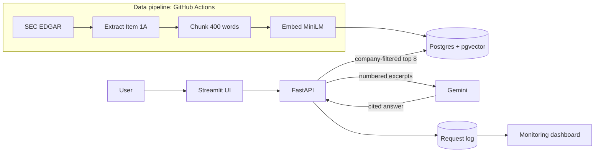

# Filings Q&A

**Retrieval-augmented question answering over SEC 10-K Risk Factors, with citations.**

[](https://filings.streamlit.app)
[](https://github.com/grizz6/filings-qa/actions/workflows/ci.yml)
[](https://github.com/grizz6/filings-qa/actions/workflows/live-check.yml)


Filings Q&A answers natural-language questions about the risks that ten major US companies
disclose in their annual reports. Every answer is grounded in the filing text and cites the
exact passages it relies on, with links back to the source document on SEC EDGAR.

> **Q:** What does Tesla say about supply chain risk?
>
> **A:** Tesla faces risks regarding the availability of components and suppliers, which could
> lead to production delays, idle facilities, and an inability to fulfill customer
> contracts [8]. …
>
> **Source [8]:** TSLA 10-K, Item 1A, chunk `TSLA_1A_0002`

**Coverage:** Apple, Microsoft, Tesla, JPMorgan Chase, Walmart, Pfizer, Exxon Mobil, Nike,
Netflix and Delta Air Lines, using each company's most recent Form 10-K.

---

## Highlights

| | |
|---|---|
| **Grounded answers** | Responses are generated only from retrieved filing excerpts, and every claim carries a numbered citation. |
| **Measured quality** | A verified 50-question benchmark: 90% retrieval hit rate and 10/10 correct abstentions on out-of-scope questions. |
| **Regression protection** | Every pull request is evaluated; changes that lower retrieval quality are blocked automatically. |
| **Production practices** | Containerized service, hosted UI, structured request logging, a monitoring dashboard and scheduled health checks. |
| **Cloud-native** | Runs entirely on managed cloud services, with secrets held only in encrypted stores. |

## Architecture



### Request flow

1. **Company resolution.** Ticker symbols, company names and common aliases in the question
   restrict the search to the relevant filing.
2. **Retrieval.** The question is embedded with `all-MiniLM-L6-v2` and the eight most similar
   chunks are retrieved by cosine similarity from pgvector.
3. **Generation.** Gemini receives only the numbered excerpts and is instructed to cite them
   or to respond "Not found in the filings." when they do not contain the answer.
4. **Attribution.** Citation markers are mapped back to chunk IDs and links to the filing.
5. **Logging.** Outcome, latency, citation count and retrieval score are recorded for
   monitoring.

### Data pipeline

A change-triggered workflow downloads each company's latest 10-K from EDGAR,
isolates the *Item 1A. Risk Factors* section, splits it into 400-word chunks with 50-word
overlap (328 chunks in total), embeds them and writes them to the vector store. Pull requests
build into a separate index so the production index is never affected by unmerged changes.

## Evaluation

The benchmark contains 50 questions: 40 answerable questions, each paired with a gold quote
verified word-for-word against the filing text, and 10 questions the filings do not answer
(for example, revenue figures or executives' names). Labels are additionally validated by
having a language model review each company's complete Risk Factors section.

| Configuration | Chunk size / overlap | Top-k | Hit rate | MRR | Correct abstentions |
|---|---|---|---|---|---|
| A | 200 / 50 | 5 | 0.750 | 0.520 | 10/10 |
| B | 400 / 50 | 5 | 0.825 | 0.602 | 10/10 |
| **C (production)** | **400 / 50** | **8** | **0.900** | **0.612** | **10/10** |

- **Hit rate:** share of answerable questions where a retrieved chunk contains the gold quote.
- **MRR:** mean reciprocal rank of the first chunk containing the gold quote.
- **Correct abstentions:** out-of-scope questions answered "Not found in the filings."

All experiment runs are tracked in MLflow with their parameters and metrics.

## MLOps

### Continuous integration and delivery

| Workflow | Trigger | Purpose |
|---|---|---|
| CI | Pull requests, `main` | Linting, ~150 unit tests with an 80% coverage floor, secret scanning, and an **evaluation gate** (hit rate ≥ 0.875, MRR ≥ 0.59) |
| Data pipeline | Data code changes | Download, parse, chunk, embed and index the filings |
| Test-set verification | Benchmark changes | Confirms every gold quote still matches the filing text |
| Test-set audit | Benchmark changes | Model-based validation of every label against the full section |
| Experiments | On demand | Runs the experiment grid and logs results to MLflow |
| App | App changes | End-to-end answer test in the Docker image and in the hosted-app configuration |
| Weekly monitor | Scheduled | Re-validates the benchmark against the latest filings and reports usage |
| Live app check | Scheduled, on demand | Browser-based check that the deployed app returns a cited answer |

The hosted application redeploys automatically from `main`.

### Monitoring

The monitoring dashboard and weekly report track:

- request volume and answer rate;
- latency at the median and 95th percentile;
- **low-confidence retrieval rate**: the share of questions whose best match scores below
  0.40, an early signal of questions drifting outside the indexed content.

### Security and privacy

- Credentials live only in GitHub Actions secrets and Streamlit's encrypted secrets store;
  the repository history is scanned for secrets on every change.
- Database tables use row-level security, closing the public data-API path.
- Model output is rendered as plain text with citations only.
- Visitors' question text is never displayed publicly; the dashboard shows aggregate
  metrics only.
- Input length limits, a daily request budget and sanitized error messages protect the
  public deployment.

## Tech stack

| Area | Technology |
|---|---|
| Language | Python 3.11 |
| Data ingestion | SEC EDGAR API, Requests, BeautifulSoup, lxml |
| Embeddings | sentence-transformers (`all-MiniLM-L6-v2`), PyTorch (CPU) |
| Vector store and logging | Supabase Postgres, pgvector |
| Generation | Google Gemini (`gemini-3.1-flash-lite`) |
| Serving | FastAPI, Streamlit, Altair |
| Experiment tracking | MLflow |
| Testing and quality | pytest, pytest-cov, Ruff, Playwright |
| CI/CD and scheduling | GitHub Actions |
| Security | gitleaks, Postgres row-level security |
| Packaging and hosting | Docker, Streamlit Community Cloud |

## Repository structure

```
src/        Pipeline (download, parse, chunk, index), retrieval, generation,
            evaluation, API service and monitoring
app/        Streamlit application: Ask page and Monitoring dashboard
eval/       Benchmark, experiment grid and quality thresholds
checks/     Browser-based check of the deployed application
tests/      Unit tests for the pipeline, API and user interface
.github/    CI/CD, data, evaluation and monitoring workflows
```
