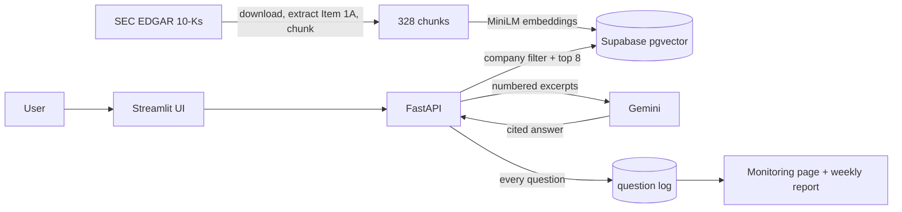

# Filings Q&A

Ask plain-English questions about the **Risk Factors** in the annual reports (Form 10-K) of
ten major US companies and get short answers that cite the exact passages of the filings.

**Live app: [filings.streamlit.app](https://filings.streamlit.app)**

> *"What does Tesla say about supply chain risk?"*
>
> Tesla faces risks regarding the availability of components and suppliers, which could lead
> to production delays, idle facilities, and an inability to fulfill customer contracts [8]…
>
> [8] TSLA · `TSLA_1A_0002` · *open the 10-K*

Companies: Apple, Microsoft, Tesla, JPMorgan Chase, Walmart, Pfizer, Exxon Mobil, Nike,
Netflix and Delta Air Lines (latest 10-K of each, straight from SEC EDGAR).

## Goal

Build a retrieval-augmented generation (RAG) system the way production ML systems are built:
reproducible data pipelines, a verified evaluation set, tracked experiments, automated quality
gates that block regressions, a containerized and hosted app, and monitoring in production.
Everything runs in the cloud on free services, with no local model.

## What it does

- **Answers with evidence.** Every claim in an answer carries a numbered citation that links
  to the source filing on sec.gov.
- **Stays on the right company.** A question that names a company ("Tesla", "TSLA",
  "JPMorgan") is answered only from that company's filing.
- **Knows the limits of its sources.** When the filings do not contain the answer (revenue
  figures, executives' names), it replies "Not found in the filings." instead of guessing.
- **Shows its work.** Each answer lists the retrieved excerpts with their similarity scores.
- **Monitors itself.** A Monitoring page tracks usage, answer rate, response time and
  retrieval confidence over time.

## How it works



1. **Data pipeline.** A GitHub Actions workflow downloads each company's latest 10-K from SEC
   EDGAR, extracts the "Item 1A. Risk Factors" section, and splits it into 400-word chunks
   with a 50-word overlap.
2. **Indexing.** Each chunk is embedded with `all-MiniLM-L6-v2` and stored in Postgres with
   pgvector, together with its company and the URL of the filing.
3. **Retrieval.** The question is embedded the same way; the 8 most similar chunks are found
   by cosine similarity, filtered to the company the question names.
4. **Answering.** Gemini receives only those excerpts, numbered [1] to [8], with instructions
   to cite them and to say "Not found in the filings." when they do not hold the answer.
   Citation numbers are mapped back to chunks and links to the filing.
5. **Serving.** A FastAPI service exposes `/ask`, `/health` and `/stats`; the Streamlit UI
   on top of it is hosted on Streamlit Community Cloud. The same app also ships as a
   Docker image.

## Evaluation

A 50-question test set drives every decision: 40 questions the filings answer, each paired
with a gold quote verified word-for-word against the filing text, and 10 questions they do
not answer. Gemini also reads each company's full section to confirm every label.

| configuration | chunk words / overlap | top_k | hit rate | MRR | correct "not found" |
|---|---|---|---|---|---|
| A | 200 / 50 | 5 | 0.750 | 0.520 | 10/10 |
| B | 400 / 50 | 5 | 0.825 | 0.602 | 10/10 |
| **C (live)** | 400 / 50 | 8 | **0.900** | **0.612** | **10/10** |

- **Hit rate**: share of answerable questions where a retrieved chunk contains the gold quote.
- **MRR**: mean reciprocal rank of that chunk (how high it ranks).
- **Correct "not found"**: unanswerable questions answered "Not found in the filings."

Every run is tracked in MLflow with its parameters and metrics, and the best configuration
(C) is the one in production.

## Quality gates and automation

| Workflow | Runs | What it ensures |
|---|---|---|
| CI | every pull request | lint, 140+ unit tests with a coverage floor, secret scanning, and an **evaluation gate** that fails the change if hit rate drops below 0.875 or MRR below 0.59 |
| Data pipeline | data code changes | rebuilds and re-indexes the filings; pull requests use a separate index |
| Test set verify and audit | test set changes | every gold quote still matches the filing; every label is confirmed |
| Experiments | on demand | runs the experiment grid and logs it to MLflow |
| App | app changes | asks a real question end to end, both in the Docker image and installed exactly as the hosted app is |
| Weekly monitor | Mondays | re-checks the test set against the latest filings and the quality gate; usage report |
| Live app check | Mondays and on demand | opens the hosted app in a browser, asks a question and confirms a cited answer |

## Monitoring

Every question is logged with its outcome, latency, number of citations and top retrieval
score. The Monitoring page and a weekly report summarize:

- questions per day and the share answered from the filings;
- response time (median and 95th percentile);
- **low-confidence retrievals**: questions whose best match scores below 0.40. Its trend
  shows when people start asking about topics the filings do not cover, the signal to add
  data or tune retrieval.

The app also has guardrails for a public deployment: question length limits, a daily
question budget, and error messages that never expose internals.

## Tools and what each one brings

| Tool | Role | What it achieves |
|---|---|---|
| SEC EDGAR | data source | authoritative, public filings with stable URLs for citations |
| BeautifulSoup + lxml | parsing | clean Risk Factors text out of large 10-K HTML documents |
| sentence-transformers (`all-MiniLM-L6-v2`) | embeddings | fast, compact semantic search that runs on CPU |
| Supabase Postgres + pgvector | vector store and question log | similarity search and app data in one managed database |
| Google Gemini (`gemini-3.1-flash-lite`) | answer generation | quick, grounded answers from the retrieved excerpts |
| FastAPI | API | typed, validated endpoints with interactive docs |
| Streamlit + Altair | UI and monitoring dashboard | an interactive app and charts in pure Python |
| MLflow | experiment tracking | comparable, reproducible experiment runs |
| pytest + ruff | testing and linting | 140+ fast unit tests and consistent code style |
| GitHub Actions | CI/CD and scheduling | pipelines, quality gates and monitoring with no servers to run |
| gitleaks | secret scanning | keeps credentials out of the repository history |
| Docker | packaging | one image that runs the API and UI on any container host |
| Streamlit Community Cloud | hosting | the public app, redeployed on every merge to `main` |
| Playwright | live checks | verifies the hosted app the way a visitor uses it |

## Project layout

```
src/        download, parse, chunk, index, retrieve, answer, llm, testset,
            evaluate, api (FastAPI), monitor (question log and summaries)
app/        Streamlit UI: Ask page and Monitoring page
eval/       test set, experiment grid, quality thresholds, demo questions
checks/     live check of the hosted app
tests/      unit tests, including the API and both UI pages
.github/    workflows for CI, data, evaluation, the app and monitoring
```
